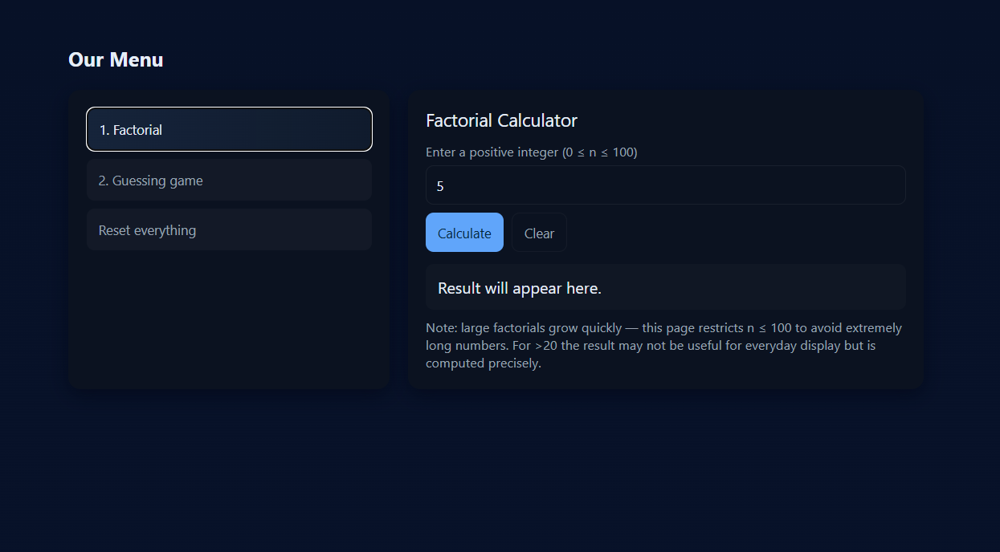

# 🎮 Mini Menu Games

A simple, single-page web application featuring two interactive mini-games/tools: a **Factorial Calculator** and a **Number Guessing Game**. The application uses pure HTML, CSS, and vanilla JavaScript for a lightweight, dependency-free experience.

---

## 🚀 Features

### 1. Factorial Calculator
* **Calculates** the factorial ($n!$) for positive integers up to $n=100$.
* Uses **BigInt** in JavaScript to handle the massive numbers generated by factorials beyond $20!$, ensuring **precise calculation** for very large results.
* Includes input validation for negative numbers and exceeding the $n=100$ limit.

### 2. Guessing Game
* The player attempts to guess a **randomly generated number** between 1 and 100.
* Limited to **5 attempts**.
* Provides feedback after each guess (Too high/Too low).
* Allows the user to start a **New Game** at any time.

---

## 🛠️ Technology Stack

* **HTML5**: Structure and content.
* **CSS3**: Minimal, clean dark theme styling.
* **Vanilla JavaScript**: All application logic, including menu navigation, factorial calculation, and game mechanics.

---

## 🌐 Live Site Deployment

Experience the application live: [https://soheibkaddouri.github.io/mini-menu-games/](https://soheibkaddouri.github.io/mini-menu-games/)

**View the Repository Here:**
> https://github.com/SoheibKaddouri/mini-menu-games

---

## 💻 Setup and Usage

This project is a single-file application.

1.  **Clone the repository**:
    ```bash
    git clone [https://github.com/SoheibKaddouri/mini-menu-games.git](https://github.com/SoheibKaddouri/mini-menu-games.git)
    cd mini-menu-games
    ```
2.  **Open the file**: Simply open the `index.html` file in any modern web browser, or view the **Live Demo** link above.

### Using the Calculator
1.  Click the **"1. Factorial"** menu item (it's the default view).
2.  Enter an integer between 0 and 100 in the input field.
3.  Click the **"Calculate"** button.

### Playing the Guessing Game
1.  Click the **"2. Guessing game"** menu item.
2.  Enter a number between 1 and 100.
3.  Click **"Submit Guess"**.
4.  If you run out of attempts or guess correctly, click **"New Game"** to reset.

---

## 🎨 Design Notes

The application uses a responsive design with a dark theme inspired by modern development environments.

| CSS Variable | Description | Example Value |
| :--- | :--- | :--- |
| `--bg` | Main background color | `#0f1724` (Dark Blue/Gray) |
| `--accent` | Primary button/focus color | `#60a5fa` (Bright Blue) |
| `--success` | Correct result color | `#22c55e` (Bright Green) |
| `--danger` | Error/Game over color | `#ef4444` (Bright Red) |
| `--glass` | Subtle background for interactive elements | `rgba(255,255,255,0.03)` |

---

## 📸 Application Screenshot



---


## 🤝 Contribution

This is a personal project, but suggestions and feedback are welcome!

***

**Soheib Kaddouri** / **SoheibKaddouri**
